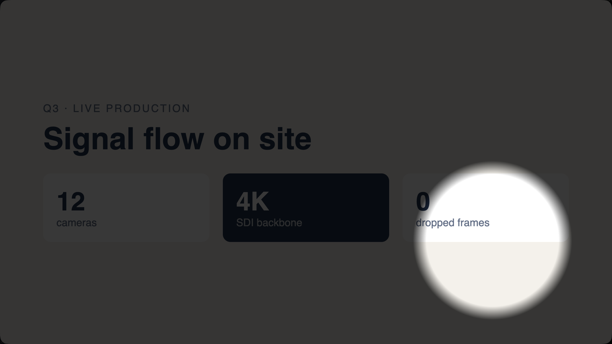
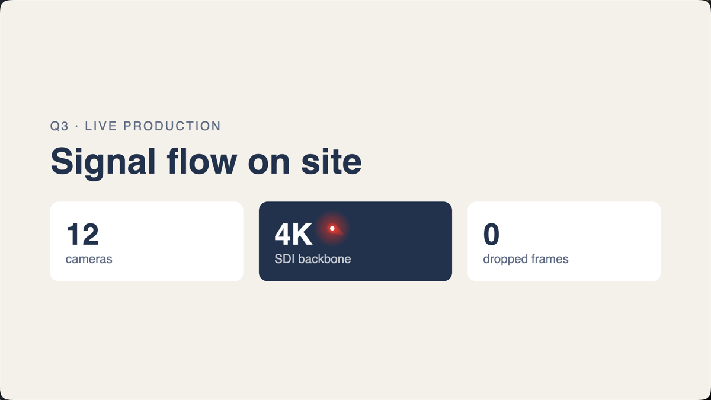
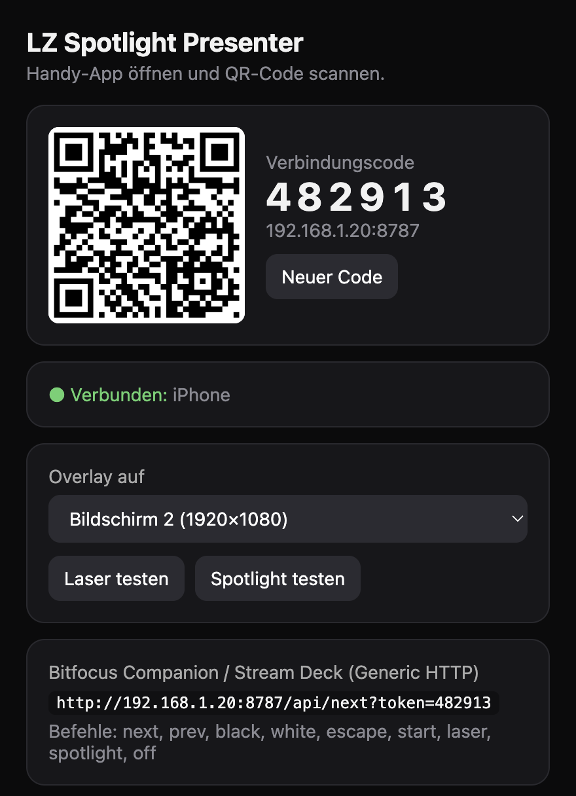
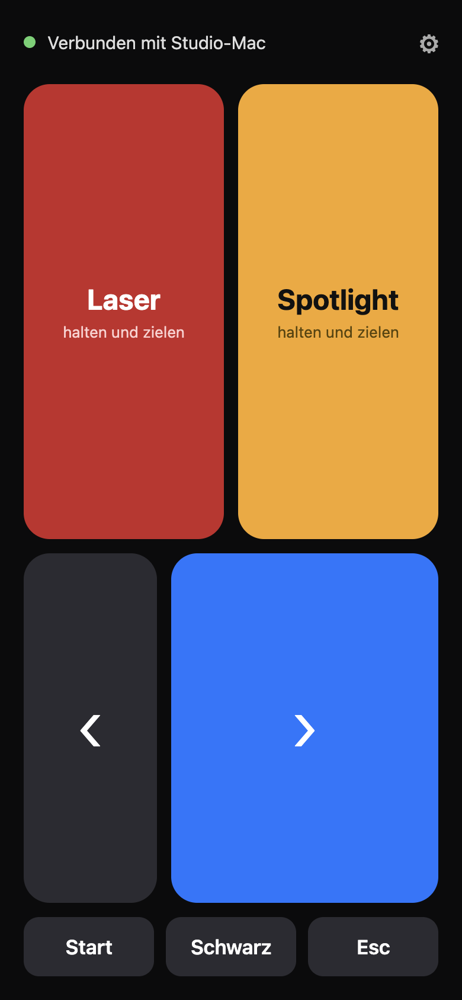
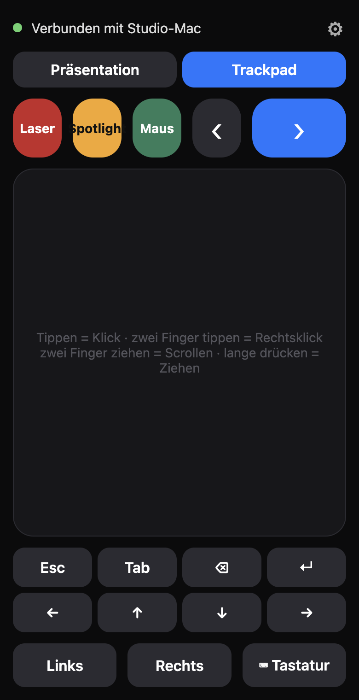

<p align="center">
  <picture>
    <source media="(prefers-color-scheme: dark)" srcset="docs/brand/lzm_hauptlogo_offwhite.svg" />
    
  </picture>
</p>

<h1 align="center">LZ Spotlight Presenter</h1>

<p align="center">
  <b>Your phone as a presenter remote with laser pointer and spotlight, for macOS and Windows.</b><br />
  Scan the QR code, the remote opens in the phone's browser. No app, no extra hardware, any network.
</p>

<p align="center">
  <a href="https://github.com/larszu/lz-spotlight-presenter/releases/latest">
    
  </a>
  &nbsp;
  <a href="#phone">
    
  </a>
</p>

<p align="center">
  
</p>

---

## Why LZ Spotlight Presenter

- **Point with the phone you already carry.** The motion sensor drives a laser
  dot or a spotlight. No clicker or dongle to buy, nothing to charge.
- **No app needed.** The QR code opens the remote in Safari or Chrome. An
  optional iOS/Android app exists for the same controls.
- **Works on any network.** The desktop app opens a free, encrypted Cloudflare
  tunnel, so the phone connects over venue Wi-Fi, guest Wi-Fi or mobile data.
  No VPN, no port forwarding, no account.
- **Works offline too.** Connect the computer to the phone's hotspot (Wi-Fi,
  USB or Bluetooth) and everything stays local.
- **On top of every presentation.** PowerPoint, Keynote, Google Slides, PDF,
  a browser: the pointer is a transparent overlay that stays above full-screen
  apps and never takes focus away.
- **Air mouse.** *Maus* works like the laser, but moves the real mouse
  cursor – aim at a link or a video and tap to click.
- **Trackpad and keyboard.** A second tab turns the phone into a touchpad –
  move, click, right-click, scroll, drag – and the phone keyboard types on the
  computer. Laser, spotlight and slide keys stay on the same screen.
- **Hardware remote.** An ESP32 with a gyro and buttons works instead of the
  phone – with a touch screen on the Waveshare ESP32-S3 AMOLED 1.8, see
  [`esp32/`](esp32/README.md).
- **Slide control included.** Next, previous, start, black screen, Esc — sent
  as keystrokes to the app in front.
- **Pairing in seconds.** Scan the QR code shown on the computer, done. The
  phone reconnects by itself and stays awake while the remote is open.
- **The right screen.** The overlay sits on the projector or external display,
  and you can switch it to any other screen.
- **Companion and Stream Deck.** Every command is also an HTTP GET for
  Bitfocus Companion's *Generic HTTP* module.
- **Private.** A new random link per pairing; links through the internet
  carry a long secret, the short code only works on the local network. No
  account, no tracking. Free and open source.

## Screenshots

<table>
  <tr>
    <td width="50%" align="center"><br /><b>Laser pointer</b></td>
    <td width="50%" align="center"><br /><b>Desktop app</b></td>
  </tr>
  <tr>
    <td width="50%" align="center"><br /><b>Remote in the phone browser</b></td>
    <td width="50%" align="center"><br /><b>Trackpad &amp; keyboard</b></td>
  </tr>
</table>

## How it compares

| | **LZ Spotlight Presenter** | Logitech Spotlight | Presentation Pointer | Unified Remote |
| --- | --- | --- | --- | --- |
| Price | **Free, open source** | ~€100–130 (hardware) | ~$2 | Freemium |
| Remote | **Any phone browser, optional app** | Dedicated clicker | iPhone app | iOS + Android app |
| Network | **Any: Wi-Fi, mobile data, hotspot** | USB receiver / Bluetooth | Same Wi-Fi | Same Wi-Fi / Bluetooth |
| Computer | **macOS + Windows** | macOS + Windows | macOS | macOS + Windows + Linux |
| Motion pointer | **Laser + spotlight** | Highlight, magnify, laser | Laser dot | Mouse only |
| Slide control | **Yes** | Yes | Yes | Yes |
| Companion / Stream Deck | **HTTP API** | No | No | No |

## Install

### Desktop

Download from [Releases](https://github.com/larszu/lz-spotlight-presenter/releases/latest):

- **macOS** — `.dmg` (universal, Apple silicon and Intel). The app is not
  notarised: on first launch right-click → *Open*. For slide keys, trackpad and keyboard allow
  *System Settings → Privacy & Security → Accessibility* for
  **LZ Spotlight Presenter**; the app has a button that opens the setting.
  Typing asks once to control *System Events*. Laser and spotlight work without either.
  The app is unsigned, so macOS forgets this permission after every update
  while the switch still looks on: remove the entry with “–”, restart the app
  and allow it again. The phone shows a notice when this is needed.
- **Windows** — `Setup.exe`. Allow *private networks* in the firewall prompt.

### Phone

Nothing to install: scan the QR code with the camera, the remote opens in the
browser. On iPhone allow the motion sensor once when asked.

Optional app (same controls, works on the local network without internet):
run it with [Expo Go](https://expo.dev/go) until it is in the stores:

```bash
cd mobile
npm install
npx expo start
```

## Usage

1. Start the desktop app. It shows a QR code.
2. Scan it with the phone camera and open the link.
3. Hold the phone like a remote: screen up, top edge towards the screen.
4. Hold **Laser**, **Spotlight** or **Maus** and aim. Laser and spotlight start
   in the centre; *Maus* moves the real mouse cursor from where it is.

**Trackpad tab:** one finger moves the mouse, tap = click, two-finger tap =
right click, two fingers = scroll, long press = drag. *⌨︎ Tastatur* opens the
phone keyboard; what you type appears on the computer, with Esc, Tab, ⌫, ↵
and arrow keys above it. Laser, spotlight and ‹ › work alongside.

**Which QR code?** *Überall (Internet)* works from any network, including
mobile data, and gives motion control in the browser. *Nur lokales Netz*
needs phone and computer in the same network and no internet; in the browser
you then steer laser and spotlight with the finger (hold the button and
drag), the app also uses motion.

**No shared Wi-Fi and no internet?** Turn on the phone's hotspot and connect
the computer to it – via Wi-Fi, USB cable or Bluetooth – then use
*Nur lokales Netz*.

Settings on the phone (⚙︎): sensitivity, invert axes, hold-to-point or
tap-to-toggle. *Neuer Code* on the desktop makes all old links invalid.

### Companion / Stream Deck

```
http://<computer-ip>:8787/api/<command>?token=<code>
```

The 6-digit code works on the local network only.

Commands: `next`, `prev`, `black`, `white`, `escape`, `start`, `laser`, `spotlight`, `mouse`, `off`.

## How it works

```
Phone browser / app                  Desktop app (Electron, port 8787)
                                     ┌─ GET /       browser remote
motion ─ move {dx,dy} ─┐             ├─ WebSocket   commands
buttons ─ mode / key ──┼─▶ Wi-Fi ───▶├─ /api/...    Companion
                       └─▶ internet ─┤  (Cloudflare quick tunnel, https)
                                     ├─ overlay window: transparent, click-through,
                                     │  always on top, draws laser / spotlight
                                     └─ keyboard + mouse: one helper process,
                                        JXA/CGEvent (macOS), PowerShell SendInput (Windows)
```

The tunnel uses [cloudflared](https://github.com/cloudflare/cloudflared),
downloaded once on first start. HTTPS is also what lets the phone browser read
the motion sensor. Tailscale and other VPN addresses are not offered, because
the phone in the room is not on them.

JSON over WebSocket. The first message is `{"type":"hello","token":"<key>"}`, then:

| Message | Meaning |
|---|---|
| `{"type":"mode","mode":"laser"\|"spotlight"\|"mouse"\|"off"}` | show / hide the pointer; `mouse` moves the system cursor |
| `{"type":"move","dx":0.01,"dy":-0.004}` | move by a fraction of screen width / height |
| `{"type":"key","action":"next"}` | `next`, `prev`, `black`, `white`, `escape`, `start`, `enter`, `backspace`, `tab`, `space`, `left`, `right`, `up`, `down` |
| `{"type":"mouse","dx":12,"dy":-4}` | move the mouse by pixels |
| `{"type":"button","button":"left"\|"right","phase":"click"\|"down"\|"up"}` | mouse buttons |
| `{"type":"scroll","dy":-30}` | scroll |
| `{"type":"text","text":"Hallo"}` | type text |

## Build from source

Requires [Node.js](https://nodejs.org/) 20+.

```bash
# Desktop
cd desktop && npm install
npm start          # run
npm test           # unit tests
npm run dist:mac   # .dmg   (dist:win: Windows installer)

# Phone
cd mobile && npm install
npm test && npm run typecheck
npx expo start
```

Release: push a tag `v1.2.3`; GitHub Actions builds the macOS and Windows
installers and attaches them to the release. Store builds of the phone app:
`npx eas-cli@latest build --platform ios|android`.

```
desktop/   Electron app: server, browser remote, tunnel, overlay, keystrokes
mobile/    optional Expo app (iOS + Android)
esp32/     firmware for the ESP32 hardware remote
```

Built with Electron, Expo, React Native, TypeScript and ws. MIT licence.
