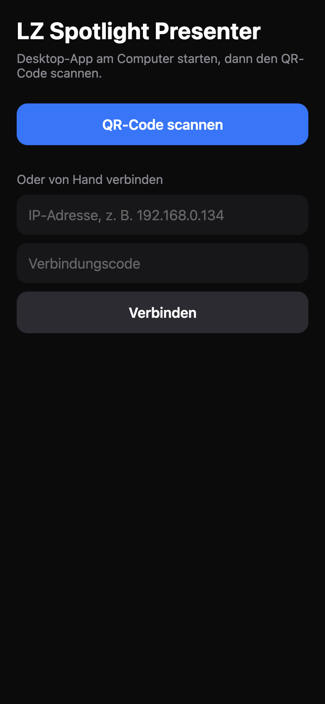

<p align="center">
  <picture>
    <source media="(prefers-color-scheme: dark)" srcset="docs/brand/lzm_hauptlogo_offwhite.svg" />
    
  </picture>
</p>

<h1 align="center">LZ Spotlight Presenter</h1>

<p align="center">
  <b>Your phone as a presenter remote with laser pointer and spotlight, for macOS and Windows.</b><br />
  Aim the phone, and the pointer moves on the screen. Free, local Wi-Fi, no extra hardware.
</p>

<p align="center">
  <a href="https://github.com/larszu/lz-spotlight-presenter/releases/latest">
    
  </a>
  &nbsp;
  <a href="#phone-app">
    
  </a>
</p>

<p align="center">
  
</p>

---

## Why LZ Spotlight Presenter

- **Point with the phone you already carry.** The gyroscope drives a laser dot
  or a spotlight. No clicker or dongle to buy, nothing to charge.
- **On top of every presentation.** PowerPoint, Keynote, Google Slides, PDF,
  a browser: the pointer is a transparent overlay that stays above full-screen
  apps and never takes focus away.
- **Slide control included.** Next, previous, start, black screen, Esc — sent
  as keystrokes to the app in front.
- **Pairing in seconds.** Scan the QR code shown on the computer, done. The
  phone reconnects by itself and stays awake while the remote is open.
- **The right screen.** The overlay sits on the projector or external display,
  and you can switch it to any other screen.
- **Companion and Stream Deck.** Every command is also an HTTP GET for
  Bitfocus Companion's *Generic HTTP* module.
- **Local and private.** Phone and computer talk directly over Wi-Fi. No
  account, no cloud, no tracking. Free and open source.

## Screenshots

<table>
  <tr>
    <td width="50%" align="center"><br /><b>Laser pointer</b></td>
    <td width="50%" align="center"><br /><b>Desktop app</b></td>
  </tr>
  <tr>
    <td width="50%" align="center"><br /><b>Phone remote</b></td>
    <td width="50%" align="center"><br /><b>Pairing</b></td>
  </tr>
</table>

## How it compares

| | **LZ Spotlight Presenter** | Logitech Spotlight | Presentation Pointer | Unified Remote |
| --- | --- | --- | --- | --- |
| Price | **Free, open source** | ~€100–130 (hardware) | ~$2 | Freemium |
| Remote | **iOS + Android phone** | Dedicated clicker | iPhone | iOS + Android |
| Computer | **macOS + Windows** | macOS + Windows | macOS | macOS + Windows + Linux |
| Motion pointer | **Laser + spotlight** | Highlight, magnify, laser | Laser dot | Mouse only |
| Slide control | **Yes** | Yes | Yes | Yes |
| Companion / Stream Deck | **HTTP API** | No | No | No |

## Install

### Desktop

Download from [Releases](https://github.com/larszu/lz-spotlight-presenter/releases/latest):

- **macOS** — `.dmg` (universal, Apple silicon and Intel). The app is not
  notarised: on first launch right-click → *Open*. For slide keys allow
  *System Settings → Privacy & Security → Accessibility* for
  **LZ Spotlight Presenter**; the app has a button that opens the setting.
  Laser and spotlight work without it.
- **Windows** — `Setup.exe`. Allow *private networks* in the firewall prompt.

### Phone app

Until the app is in the App Store and Play Store, run it with
[Expo Go](https://expo.dev/go):

```bash
cd mobile
npm install
npx expo start
```

Scan the QR code in the terminal with the iPhone camera (Android: with Expo Go).
Phone and computer must be on the same Wi-Fi.

## Usage

1. Start the desktop app. It shows a QR code and a 6-digit code.
2. In the phone app tap **QR-Code scannen** and scan the code. Scanning with
   the system camera opens a pairing page with the same details.
3. Hold the phone like a remote: screen up, top edge towards the screen.
4. Hold **Laser** or **Spotlight** and aim. The pointer starts in the centre.

Phone settings: sensitivity, invert axes, hold-to-point or tap-to-toggle.
*Neuer Code* on the desktop disconnects all phones.

### Companion / Stream Deck

```
http://<computer-ip>:8787/api/<command>?token=<code>
```

Commands: `next`, `prev`, `black`, `white`, `escape`, `start`, `laser`, `spotlight`, `off`.

## How it works

```
Phone app (Expo)                     Desktop app (Electron)
gyroscope ─ move {dx,dy} ─┐          ┌─ overlay window: transparent, click-through,
buttons ── mode / key ────┼─ WS ────▶│  always on top, draws laser / spotlight
                          │  :8787   └─ keystrokes: osascript (macOS),
Companion ── HTTP GET ────┘             PowerShell keybd_event (Windows)
```

JSON over WebSocket. The first message is `{"type":"hello","token":"123456"}`, then:

| Message | Meaning |
|---|---|
| `{"type":"mode","mode":"laser"\|"spotlight"\|"off"}` | show / hide the pointer |
| `{"type":"move","dx":0.01,"dy":-0.004}` | move by a fraction of screen width / height |
| `{"type":"key","action":"next"}` | `next`, `prev`, `black`, `white`, `escape`, `start` |

## Build from source

Requires [Node.js](https://nodejs.org/) 20+.

```bash
# Desktop
cd desktop && npm install
npm start          # run
npm test           # unit tests
npm run dist:mac   # .dmg   (dist:win: Windows installer)

# Phone
cd mobile && npm install
npm test && npm run typecheck
npx expo start
```

Release: push a tag `v1.2.3`; GitHub Actions builds the macOS and Windows
installers and attaches them to the release. Store builds of the phone app:
`npx eas-cli@latest build --platform ios|android`.

```
desktop/   Electron app: server, overlay, keystrokes, pairing window
mobile/    Expo app (iOS + Android): pairing, remote, settings
```

Built with Electron, Expo, React Native, TypeScript and ws. MIT licence.
